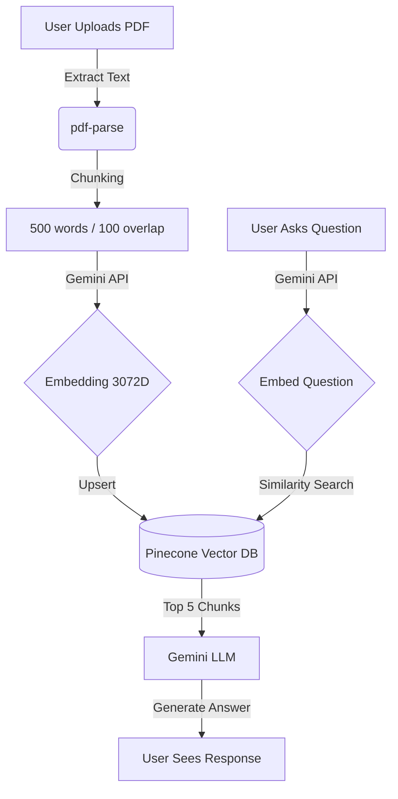

# Legal AI Analyzer

A full-stack RAG (Retrieval-Augmented Generation) application built to analyze legal documents using Gemini AI and Pinecone.

## 🚀 Architecture



## 🛠️ Tech Stack

- **Frontend**: React, Vite, Tailwind CSS v4, React Router
- **Backend**: Node.js, Express, MongoDB (Mongoose)
- **AI/Vector DB**: Google Gemini (Embeddings & LLM), Pinecone
- **File Processing**: Multer, pdf-parse

## 🏃‍♂️ Running Locally

### 1. Prerequisites
- Node.js (v18+)
- MongoDB Atlas Account
- Pinecone Account (create an index with 3072 dimensions, metric: cosine)
- Google AI Studio (Gemini API Key)

### 2. Setup Server
```bash
cd server
npm install
cp .env.example .env
# Fill in your .env variables
node index.js
```

### 3. Setup Client
```bash
cd client
npm install
cp .env.example .env
# Default VITE_API_URL is http://localhost:5000
npm run dev
```

## 🚀 Preparing for Deployment

1. **Database**: Your MongoDB is already hosted on Atlas. Ensure Network Access (IP Whitelist) allows connections from anywhere (`0.0.0.0/0`) if deploying on modern PAAS like Render/Vercel.
2. **Backend (Render/Railway)**: Deploy the `server` folder as a Web Service. Add all `.env` variables to the platform dashboard.
3. **Frontend (Vercel/Netlify)**: Deploy the `client` folder. Make sure to set `VITE_API_URL` to your newly deployed backend URL!
